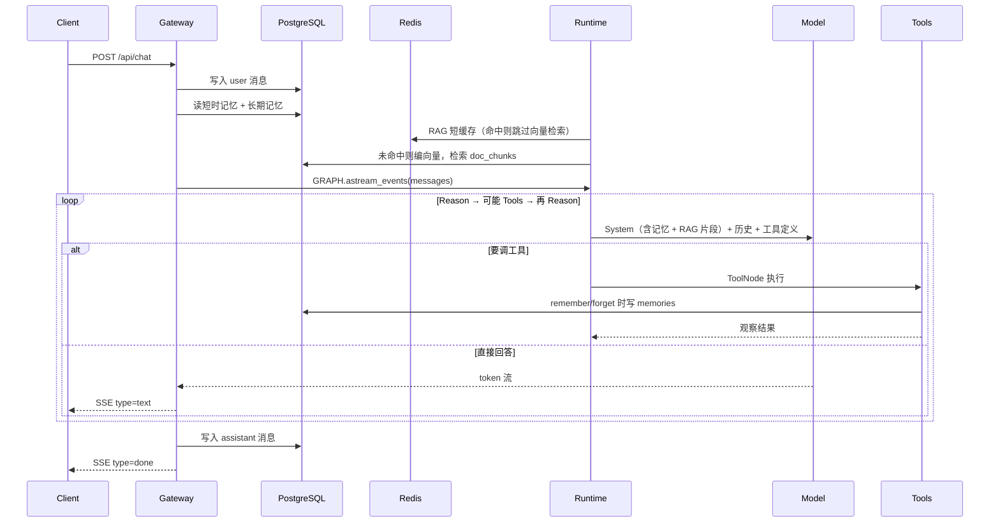
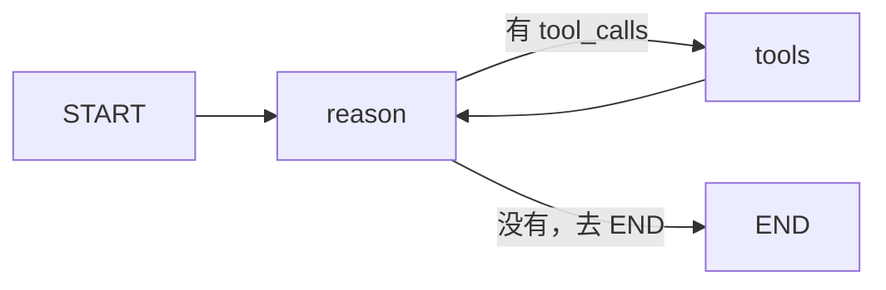

# 一次对话怎么跑完（V3）

对应代码：`clients/web`、`clients/cli.py`、`clients/desktop.py`、`gateway/`、`runtime/graph.py`。
架构总图仍看仓库根目录 `README.MD`。

`reason` 是「推理」那个 reason，不是「原因」。来自 ReAct：**Reason（想）→ Act（动手）→ Observe（看结果）**。节点名叫 `think` 或 `llm`，行为一样；真正「想」的是模型，这个节点只表示「该让模型想一轮了」。

---

## 1. 从发送到看见回复

中间走 README 那几层：**Client → Gateway → Runtime →（Model / Data / Tools）→ 再经 Gateway 流式回 Client**。一次发送不是「调一次 LLM 就结束」，LangGraph 可能转好几圈。



分步：

1. **Client（Web / CLI / 桌面 / 手机）**  
   Web 点发送后立刻插入一条 user、一条空的 assistant，然后 `POST /api/chat`。CLI / 桌面走 `clients/api.py` 的同一条接口。响应是 SSE（`text/event-stream`），每个 `data: {...}` 改这条空气泡。页面上先出现的字是乐观渲染；模型真正开始说话，要等第一次 `reason` 打到云端之后。请求带 `X-Client`（web / cli / desktop），Gateway 目前只作标识，不做鉴权。

2. **Gateway（Django + DRF）**  
   校验、分配 `conversation_id`、把用户这句话写入 `messages`（短时记忆）。再读最近 20 条，转成 `HumanMessage` / `AIMessage`。图的输入只有这些历史，**不含** System Prompt——System 由 `reason` 每轮现拼。  
   `gateway/chat.py` 里 `astream_events` 边跑边吐：token、工具开始/结束。译成前端的 `text` / `tool_start` / `tool_end` / `memories`。CRUD 在 `gateway/api.py` 的 DRF 视图。

3. **Runtime**  
   见下一节。`tools_condition` 看有没有 `tool_calls`：没有则结束；有则进 `tools`，结果追加进状态，再回到 `reason`。

4. **Model / Data / Tools**  
   - Model（`model/llm.py`）：OpenAI 兼容的 `/v1/chat/completions`。换 DeepSeek 或本地，Gateway 和 Graph 不用改。  
   - Data：短时 `messages`；长期 `memories`；知识库 `documents` / `doc_chunks`。`reason` 每轮会按当前问题做一次向量检索，结果可进 Redis 短缓存。  
   - Tools：文件工具在 Gateway 进程里读写 sandbox/。`execute_python` / `execute_shell` / `git_*` 进可上网的 Docker 容器（不进 Postgres/Redis 那张网）。`remember` 写 memories；`ingest_doc` 把任务丢给 Celery。

5. **收尾**  
   图跑完（或点终止）后，Gateway 把拼好的回答写入 `messages`，再发 `done`。下次同一会话，这轮问答出现在短时窗口里；长期记忆不依赖会话，新对话也会被注入。

侧栏会话列表来自 `messages`；长期记忆来自 `memories`；知识库来自 `documents`。删会话不会清后两者。

---

## 2. LangGraph：这是一个循环吗？

是循环，但不是 `while True`。它是一张**带回路的图**：`reason → tools → reason` 可以转很多圈，直到某一轮 `reason` 不再要工具，才走出图。

图上真正的节点只有两个。`START` 和 `tools_condition` 不是节点。



对应 `runtime/graph.py` 的 `build_graph()`：

| 名称 | 是不是节点 | 作用 |
|---|---|---|
| `START` | 否，入口标记 | 每条用户消息从图这儿进，固定先到 `reason` |
| `reason` | 是 | 唯一调用 LLM 的地方。拼 System + 长期记忆 + 历史 + 工具 schema，拿回一条 `AIMessage` |
| `tools_condition` | 否，路由器 | 检查刚才那条消息有没有 `tool_calls`：有 → `tools`，没有 → `END` |
| `tools` | 是 | `ToolNode` 按模型点名在本机执行工具，把返回值写成 Tool Message。然后**强制回到 `reason`** |
| `END` | 否，出口 | 内置终点；这一轮用户请求结束 |

`reason` 的输出只有两种：

- 纯文字 → 当作最终回答，循环结束  
- 带 `tool_calls` → 还没答完，转到 `tools`

状态一直是那一份 `messages` 列表（`add_messages` 是追加不是覆盖），所以后一轮 `reason` 能看见前面工具的观察结果。

一次用户发送可能是：

- 闲聊：`START → reason → END`
- 记住一件事：`START → reason → tools(remember) → reason → END`
- 先搜再算：`reason → tools → reason → tools → reason → END`

---

## 3. 三种记忆（不要混在一张表）

| 类型 | 存在哪 | 活多久 |
|---|---|---|
| 工作记忆 | LangGraph 的 `messages` 状态 | 这一轮推理 |
| 短时记忆 | `conversations` / `messages` | 这个会话，最近 20 条 |
| 长期记忆 | `memories` | 跨对话；删会话也还在 |

三层拆分：

- `data/memory.py`：落库  
- `runtime/memory.py`：决定这一轮 LLM 看见哪些  
- `tools/memory.py`：Agent 主动记、查、忘  

检索现在是 SQL `ILIKE`，不是向量。知识库检索才是向量（V0.6）。

---

## 4. SSE 事件（Gateway → Client）

| `type` | 何时 | 前端做什么 |
|---|---|---|
| `conversation` | 一开始 | 记下会话 id |
| `status` | 开始生成 | 占位提示 |
| `text` | 模型吐 token | 往助手气泡追加 |
| `tool_start` / `tool_end` | 工具执行 | 显示工具块 |
| `memories` | remember / forget 结束 | 刷新侧栏长期记忆 |
| `documents` | ingest_doc 结束 | 刷新侧栏知识库 |
| `done` / `stopped` / `error` | 结束 | 解开输入框 |

---

## 5. 对照目录

```
clients/web     Web / 手机浏览器
clients/cli.py  终端
clients/desktop.py  桌面 WebView
clients/api.py  CLI/桌面共用的 Gateway 客户端
gateway/        Django + DRF：会话、落库、译事件（ASGI SSE）
runtime/graph.py  Agent 循环
runtime/memory.py  长期记忆装配进 Prompt
runtime/rag.py     知识库命中装配进 Prompt
model/llm.py    OpenAI 兼容聊天
model/embed.py  文本向量
data/db.py      短时记忆表
data/memory.py  长期记忆表
data/rag.py     文档块 + 向量检索
data/cache.py   Redis ping / RAG 短缓存
worker/         Celery：文档入库排队
tools/registry.py  工具分组登记
tools/sandbox.py   路径牢 + Docker 隔离（代码/Shell/Git）
tools/          本机工具（web / code / fs / git / memory / rag）
```

加工具：在对应模块写 `@tool`，挂进 `tools/registry.py` 的 `TOOL_GROUPS`，不要改 `graph.py`。

---

## 6. V1.5：Redis 和 Celery 干什么

聊天 SSE 仍在 Gateway，会话仍在 PostgreSQL。Redis 只做两件事：Celery 的 broker/backend，以及 `search_chunks` 的短 TTL 缓存（入库/删文档会 bump `rag:epoch`）。

文档入库不再堵在 Gateway 线程里：

1. 浏览器 `POST /api/documents`，或 Agent 调 `ingest_doc`
2. Gateway / 工具调用 `enqueue_ingest`，立刻拿到 `job_id`
3. 本机 Celery worker（`.\scripts\run_worker.ps1`，`--pool=solo`）跑切块和 embedding
4. 前端或工具轮询 `GET /api/jobs/{job_id}`，直到 SUCCESS / FAILURE

Worker 必须在 Windows 宿主机上跑，才能用到本机 `.venv` 和 ModelScope 里的 bge 模型。Redis 可以进 Docker。

---

## 7. V3：多端共用同一套 API

不做登录，不用 Django Admin。四个入口打同一个 Gateway：

| 入口 | 怎么开 | 说明 |
|---|---|---|
| Web | 浏览器打开 Gateway 地址 | `clients/web`；窄屏用「菜单」拉开侧栏 |
| CLI | `python -m clients.cli` | 读 SSE，会话写入同一张 `conversations` 表 |
| 桌面 | `python -m clients.desktop` | 有 pywebview 则开窗，否则退回系统浏览器 |
| 手机 | 同一 Wi-Fi 打开电脑局域网 IP:8080 | `.env` 里 `HOST=0.0.0.0`，`ALLOWED_HOSTS=*` |

Gateway 侧：`AllowClientCORS` 给跨域预检（`Access-Control-Allow-Origin: *`，允许 `X-Client`）。CLI / 桌面用环境变量 `AGENT_URL`（默认 `http://127.0.0.1:8080`）。`GET /api/health` 的 `clients` 字段列出这四个入口。

